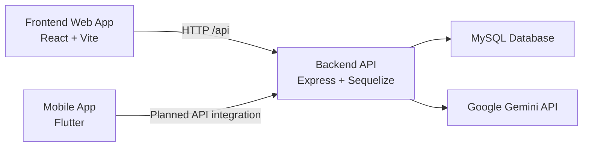

# SWD392 Academic Collaboration Platform

SWD392 is a multi-application workspace for managing academic project collaboration across web and mobile surfaces. The repository combines a Node.js backend, a React frontend, and a Flutter mobile app for workflows such as topic approval, student group management, Q&A escalation, task tracking, submission handling, and AI-assisted support.

## Overview

The system is organized around three modules:

- `BE/`: Express.js REST API with Sequelize and MySQL.
- `FE/`: React + Vite single-page application for managers, lecturers, and students.
- `MO/`: Flutter mobile application, currently in early implementation.

Core business flows covered in the repo:

1. Topic lifecycle: lecturer proposes, manager approves, student groups register.
2. Group collaboration: teams manage tasks, submissions, resources, and internal workflows.
3. Academic Q&A: students ask questions, lecturers respond, managers handle escalations.
4. AI assistance: backend-integrated Gemini endpoint for draft support and guided responses.

## Repository Structure

```text
SWD392/
├── BE/   # Node.js + Express + Sequelize + MySQL backend
├── FE/   # React 18 + Vite + TailwindCSS frontend
├── MO/   # Flutter mobile client
└── README.md
```

## Architecture



## Module Summary

### Backend (`BE`)

The backend exposes REST endpoints under `/api` and documents them with Swagger at `/api-docs`.

Main characteristics:

- Express application bootstrapped from `server.js` and `src/app.js`.
- Sequelize-based MySQL integration with a default database name of `academic_collaboration_db`.
- JWT-based authentication and role-aware behavior for `manager`, `lecturer`, and `student`.
- Controllers and routes for auth, users, semesters, classes, topics, groups, questions, answers, tasks, submissions, and AI endpoints.
- Swagger/OpenAPI documentation available locally at `http://localhost:3000/api-docs`.
- SQL bootstrap script available at `BE/database-schema.sql`.

### Frontend (`FE`)

The frontend is a React 18 SPA built with Vite and styled with TailwindCSS, Radix UI, and related component utilities.

Main characteristics:

- Public pages for landing, login, registration, FAQ, documentation, and profile.
- Role-based workspaces for manager, lecturer, and student usage.
- Student workspace modules for dashboard, topics, task board, Q&A, AI assistant, submissions, chat, and resources.
- Axios client configured through `VITE_API_BASE_URL` in `FE/src/config/api.config.js`.
- Deployment-oriented configuration for Vercel and Dockerized Nginx serving.

### Mobile (`MO`)

The mobile app is a Flutter project with theme setup, login UI, scaffolded navigation, and placeholder screens.

Current state:

- Flutter app entrypoints are in `MO/lib/main.dart` and `MO/lib/app.dart`.
- Navigation shell exists in `MO/lib/navigation/root_scaffold.dart`.
- Screens such as login, home, dashboard, and profile are present.
- Backend integration, authentication flow, and production mobile features are not yet completed.

## Feature Highlights

### Academic management

- Semester and class administration.
- Lecturer topic proposal and manager approval workflow.
- Student group creation and member management.

### Collaboration workflows

- Group task board with status and assignee tracking.
- Submission management with grading support.
- Question and answer flow with lecturer escalation to manager.

### Platform support

- JWT authentication with token refresh support.
- Swagger API documentation.
- AI assistant endpoint backed by Gemini.
- Dockerfiles for backend and frontend production builds.

## Tech Stack

| Area | Stack |
| --- | --- |
| Backend | Node.js, Express, Sequelize, MySQL, JWT, Swagger |
| Frontend | React 18, Vite, TailwindCSS, Radix UI, Axios, React Router |
| Mobile | Flutter, Dart |
| AI | Google Gemini API |
| Deployment | Docker, Nginx, Vercel |

## Prerequisites

Install the following before running the project locally:

- Node.js 18+ recommended for backend and frontend workflows.
- npm.
- MySQL 8+.
- Flutter 3.9.2+ if you want to run the mobile app.

## Local Development

### 1. Start the backend

```bash
cd BE
npm install
npm run dev
```

Available backend commands:

```bash
npm start
npm run dev
npm test
npm run test:watch
```

The backend runs on `http://localhost:3000` by default.

### 2. Start the frontend

```bash
cd FE
npm install
npm run dev
```

If your environment hits peer dependency resolution issues, use:

```bash
npm install --legacy-peer-deps
```

Available frontend commands:

```bash
npm run dev
npm run build
npm run lint
npm run preview
```

The frontend development server runs on Vite's default local port, typically `http://localhost:5173`.

### 3. Start the mobile app

```bash
cd MO
flutter pub get
flutter run
```

Optional Flutter build commands:

```bash
flutter build apk
flutter build ios
```

## Database Setup

The repository includes a full SQL bootstrap script:

- `BE/database-schema.sql`

The script recreates `academic_collaboration_db` and seeds sample data, so review it before running in any non-local environment.

Typical setup flow:

```bash
mysql -u root -p
source BE/database-schema.sql
```

Default Sequelize connection settings fall back to:

- `DB_HOST=localhost`
- `DB_PORT=3306`
- `DB_NAME=academic_collaboration_db`
- `DB_USER=root`
- `DB_PASSWORD=`

## Environment Variables

### Backend

Create `BE/.env` with values appropriate for your environment:

```env
PORT=3000
NODE_ENV=development
DB_HOST=localhost
DB_PORT=3306
DB_NAME=academic_collaboration_db
DB_USER=root
DB_PASSWORD=
JWT_SECRET=replace_me
ADMIN_EMAIL=admin@gmail.com
ADMIN_PASSWORD=admin123
GEMINI_API_KEY=replace_me
GEMINI_MODEL=gemini-2.0-flash
```

Notes:

- The backend bootstraps a default manager account if the configured admin email does not exist.
- `JWT_SECRET` and `GEMINI_API_KEY` should always be set explicitly outside local experiments.

### Frontend

The frontend expects `VITE_API_BASE_URL`.

Example local configuration:

```env
VITE_API_BASE_URL=http://localhost:3000/api
```

Additional optional integrations are referenced in the frontend for Firebase and Cloudinary-based uploads.

## API and Technical Documentation

Useful documentation already included in the repo:

- `BE/docs/SWAGGER_API_DOCUMENTATION.md`
- `BE/docs/DATABASE_DOCUMENTATION.md`
- `BE/docs/INTEGRATION_SUMMARY.md`
- `BE/docs/DATABASE_SCHEMA.md`
- `FE/markdowns/FE_REQUIREMENTS_CHECKLIST.md`
- `FE/markdowns/GROUP_WORKFLOW_EXPLANATION.md`

Local API documentation:

- Swagger UI: `http://localhost:3000/api-docs`

## Docker

Production-oriented Docker assets are included for both backend and frontend.

### Backend

- `BE/Dockerfile` builds and runs the Node.js API.
- `BE/docker-compose.yml` currently defines auxiliary services only and does not orchestrate the full stack.

### Frontend

- `FE/Dockerfile` builds the Vite app and serves it with Nginx.
- `FE/docker-compose.yml` runs the frontend container on port `5173` mapped to container port `80`.

## Current Status and Caveats

The repository is functional, but there are a few realities worth noting before onboarding new contributors:

- The backend and frontend are substantially more complete than the mobile app.
- The mobile app is not yet fully integrated with backend APIs.
- Some markdown documentation in subfolders appears older than the current implementation and should be treated as supporting material, not the single source of truth.
- The backend currently relies on environment configuration plus fallback defaults; production deployments should remove reliance on implicit defaults.

## Suggested Development Order

For a fresh local setup, use this order:

1. Prepare MySQL and import `BE/database-schema.sql`.
2. Configure `BE/.env` and start the backend.
3. Configure `FE` to point at the local API and start the frontend.
4. Treat `MO` as an optional parallel workstream until API integration is completed.

## License

No repository-wide license file is currently included.